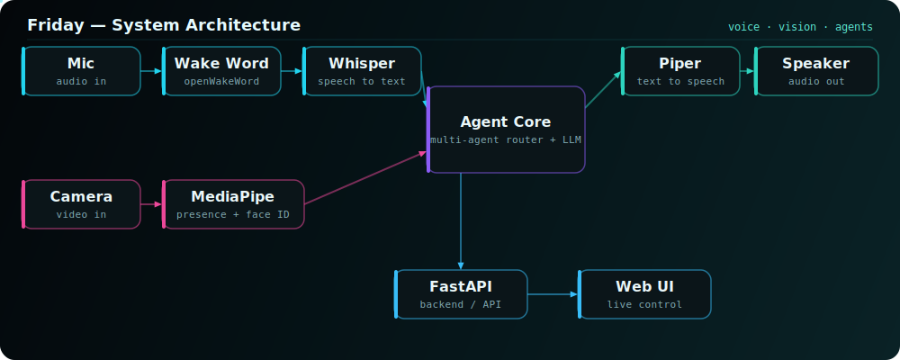

<h1 align="center">🤖 Friday</h1>
<p align="center"><b>A JARVIS-style, multi-agent AI desk assistant</b> — voice, vision, and a web UI, running on your own machine.</p>

<p align="center">


</p>

---

## ✨ What it does

Friday listens, sees, and responds — a hands-free desktop assistant that wakes on your voice, recognises who's at the desk, and talks back through a live web interface.

- 🎙️ **Voice** — wake-word detection → speech-to-text (Whisper) → LLM reasoning → natural speech (Piper TTS)
- 👁️ **Vision** — real-time presence & face recognition via **MediaPipe** (knows when you're there / who you are)
- 🧠 **Multi-agent core** — routes requests to task-specific agents
- 🖥️ **Web UI** — a **FastAPI**-served front end for live status, controls, and conversation
- ⚡ **Runs locally** — models bundled (wake-word, Whisper, Piper voices)

## 🧱 Stack

| Layer | Tech |
|---|---|
| Backend / API | **FastAPI** (Python) |
| Speech-to-text | Whisper |
| Text-to-speech | Piper (bundled voices) |
| Wake word | openWakeWord |
| Vision | MediaPipe (presence + face recognition) |
| Front end | Web UI (`frontend/`) |

## 🗺️ Architecture

<p align="center">

</p>

## 🚀 Run it

```bash
git clone https://github.com/bipin-vishwakarma/Friday.git
cd Friday
pip install -r requirements.txt

# add your keys (LLM / STT provider) to a .env file — see .env is gitignored
python launch.py         # or: launch_friday.bat  (Windows)
```

Then open the local web UI that Friday prints on startup. See **[DEPLOYMENT_GUIDE.md](DEPLOYMENT_GUIDE.md)** and **[MONITORING_SETUP.md](MONITORING_SETUP.md)** for details.

## 📂 Structure

```
src/            core assistant + agents + voice pipeline
frontend/       web UI
models/         wake-word · Whisper · Piper voice models
launch.py       one-command startup
tests/          test suite
```

## 🔐 Notes

- API keys live in a local `.env` (git-ignored) — none are committed.
- Face data & logs stay local and are never pushed.

---

<p align="center"><sub>Part of my biomedical-AI portfolio · <a href="https://github.com/bipin-vishwakarma">@bipin-vishwakarma</a></sub></p>
